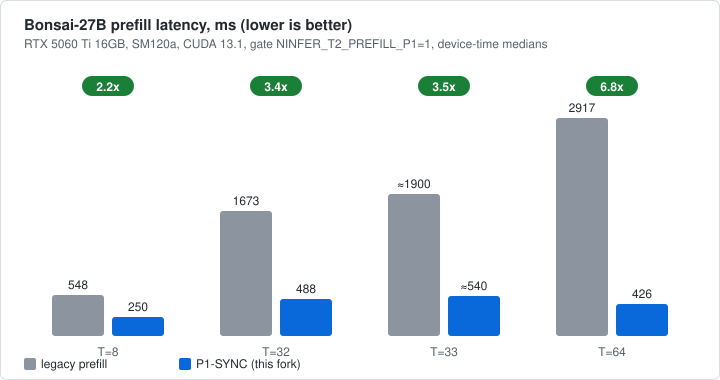
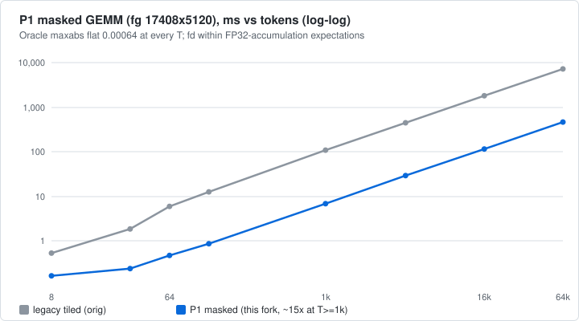
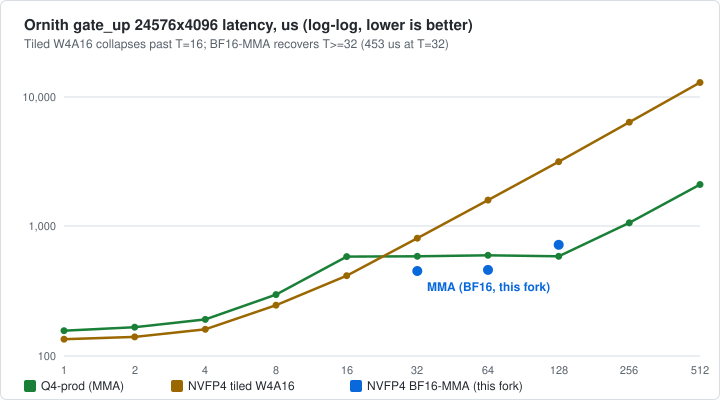
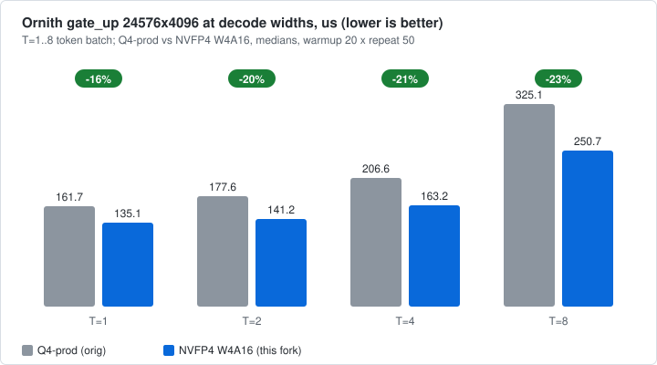
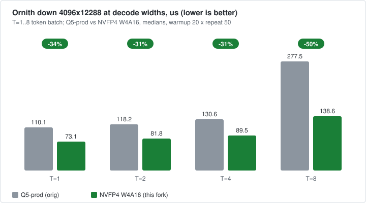
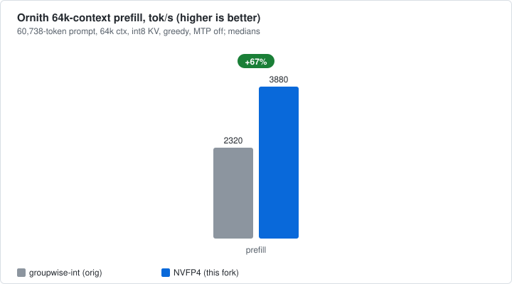
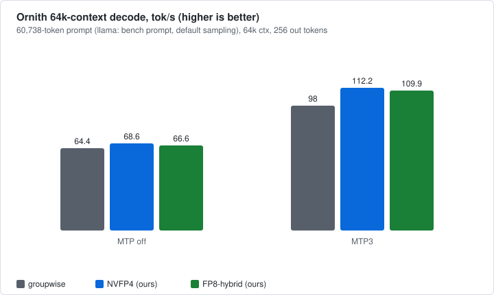

# Tokamak

> Max useful compute from hardware you already own — fusing big models into small VRAM for max tok/s. Custom CUDA kernels, low-bit LLM inference, measured numbers only, no vibes.

[](https://developer.nvidia.com/cuda-toolkit)
[](https://www.nvidia.com/en-us/geforce/)
[](#benchmarks)
[](LICENSE)

Tokamak is a research fork for squeezing maximum inference throughput out of a single
16 GB Blackwell card. We write custom CUDA kernels and low-bit execution paths, then prove them
with measurements — every chart below is a number from this GPU, not a projection.

**Lineage:** [Neroued/ninfer](https://github.com/Neroued/ninfer) (from-scratch C++/CUDA inference
engine) → [ruwwww/ninfer-5060ti](https://github.com/ruwwww/ninfer-5060ti) (RTX 5060 Ti port) →
this fork (kernel research tracks). Upstream documentation, engine, and artifacts are untouched;
everything we did lives in the branches below.

## Track map

| Track | Showcase branch | What | Status |
|---|---|---|---|
| Bonsai-27B ternary prefill/decode | [`bonsai-27b`](https://github.com/Spar2/tokamak/tree/bonsai-27b) | P1-SYNC prefill kernels (2.2–6.8×), T1-A decode (~75 ms/step), Prism-validated M6 core | ✅ Validated, gated OFF by default |
| Ornith-9B NVFP4 | [`ornith-9b-nvfp4`](https://github.com/Spar2/tokamak/tree/ornith-9b-nvfp4) | Dynamic W4A4 prefill, BF16-MMA large-T, native output head | ✅ Validated |
| Ornith-9B FP8 GDN | [`ornith-9b-fp8`](https://github.com/Spar2/tokamak/tree/ornith-9b-fp8) | Hybrid FP8 gated-delta-net execution, scale contract | ✅ Validated (contract + 64k serve smoke) |
| Concurrency 8 → 9 | [`c16-concurrency-9`](https://github.com/Spar2/tokamak/tree/c16-concurrency-9) | Batch ceiling raise + C9TRACE scheduler diagnostics | ✅ Validated (B=9 unit + decode-ready-9 serve proof) |

Full day-by-day history (13 Sep → 6 Oct 2026) is preserved in the `exp/*`, `experiment/*`,
`feature/*`, and `perf/*` branches — nothing was squashed or rebased. See
[branch guide](docs/tokamak/branches.md).

## Benchmarks

All numbers: GeForce RTX 5060 Ti 16 GB (36 SMs), SM120a, CUDA 13.1, Release build,
measured in Linux containers on this host. Methodology and full tables:
[docs/tokamak/benchmarks.md](docs/tokamak/benchmarks.md).

> **Reproducibility tags:** 🌐 = repeats from public weights · 🏠 = needs a locally
> converted artifact (pipeline documented in `exp/*` branches).

### Bonsai-27B prefill: legacy vs P1-SYNC 🏠 (device-time medians)

| Tokens | Legacy | P1-SYNC | Speedup | P1 ≈ tok/s |
|---|---:|---:|---:|---:|
| T=8 | 548 ms | 250 ms | **2.2×** | 32 |
| T=32 | 1673 ms | 488 ms | **3.4×** | 66 |
| T=33 | ~1900 ms | 540 ms | **3.5×** | 61 |
| T=64 | 2917 ms | 426 ms | **6.8×** | 150 |



The masked kernel behind those bars scales from 8-token micro-batches to
64k-token prompts with a flat oracle error — so the prefill story is not
"a few tokens":



Numerics *improved* over legacy (chain63, T=33): layer-52 maxabs 9.60 (legacy FAIL) →
1.25 (P1 PASS) — archived `bq2/chain63-all.log` vs `bq2/chain63_AUTH_ON2.log.`
Top-1 exact at T=32 (`506 == 506`) and T=33 (`271 == 271`).
Determinism: 0 failures in 1000 launches on both the synthetic and artifact-weight
harnesses (`ninfer_bq2_mindet_test`, `ninfer_bq2_mindet_art_test`).

### Bonsai-27B decode step 🏠 (T1-A widened GEMV, n=128, ≈13.3 tok/s/lane)

Median step **75.07 ms** (min 70.07, p90 80.96), bit-exact across 32 reset steps.
A per-projection GEMV budget (≈22 ms of the step) is tabulated in
[benchmarks](docs/tokamak/benchmarks.md#bonsai-27b-decode-t1-a-chain_gen-n128-short-context-no-mtpgraphs);
the rest is GDN recurrent kernels, attention, norms, and eager launches with no
CUDA graphs — decode serving (MTP/graphs) is roadmap, not claim.

### Ornith-9B MLP: T-crossover 🌐 (gate_up 24576×4096, µs medians)

| T | Q4-prod | NVFP4 tiled W4A16 | NVFP4 BF16-MMA |
|---|---:|---:|---:|
| 1–16 | 157–585 | **135–417 (wins)** | — |
| 32 | 589 | 812 (collapses) | **453 (recovers)** |
| 64 | 599 | 1597 | **462** |
| 128 | 588 | 3162 | **722** |



At decode widths (T=1..8, the shapes that matter for single-stream generation),
NVFP4 beats the groupwise baseline on every width — the reason this fork exists:




Dynamic W4A4 (T≥128, default ON, `NINFER_ORNITH_DYNAMIC_W4A4=0` falls back to pure W4A16):
perplexity GW 6.220 → W4A16 6.327 → dynamic 6.367. The draft head stays Q4 on purpose —
the heads work measured Q4→NVFP4 as parity-or-loss (620 vs 647 µs at 131072×4096;
design note in the `ornith-9b-nvfp4` history).

### Ours vs orig at 64k context, matched runs (C1, greedy)

Same 60,738-token prompt, 64k context, int8 KV, prefill chunk 4096, 256 output tokens
for the three NInfer legs (llama leg differs: bench-generated prompt, fp16 KV,
default sampling — see notes under the tables):




| Setup @64k | llama.cpp Q4_K_M | groupwise-int (orig) | NVFP4 (ours) | FP8-hybrid (ours) |
|---|---|---:|---:|---:|
| Prefill, MTP off | 2515 tok/s | 2320 tok/s | **3880 tok/s** | under optimization (see notes) |
| Decode, MTP off | 78.3 tok/s | 64.4 tok/s | **68.6 tok/s** | 66.6 tok/s |
| Decode, MTP3 | n/a (no speculation) | 98.0 tok/s (acc 47%) | **112.2 tok/s (acc 50%)** | 109.9 tok/s (acc 62%) |

llama leg: `llama-bench -p 60738 -n 256` (bench-generated prompt, default sampling,
fp16 KV, CUDA build df03399b8) — same token counts, different prompt text and KV.

Wider context (different corpora/harnesses — direction, not races):

| Setup | Orig | This fork |
|---|---|---:|
| Ornith C8 aggregate decode, MTP | 309.9 tok/s committed (upstream, 25–27k prompts) | 321 tok/s (dynfull wave, 1953-prompt corpus) |
| Bonsai prefill | 700–800 tok/s @8k prompt (llama.cpp/Prism PQ2, context) | 32/66/61/150 tok/s @T8/32/33/64 (P1-SYNC) |

Bonsai decode serving (MTP/graphs) is roadmap, not claim — see diagnosis in
[benchmarks](docs/tokamak/benchmarks.md#diagnosed-gaps-not-displayed-as-wins).
FP8 prefill likewise (per-token serial cost isolated, fused batching in progress).

<details>
<summary>Glossary for readers new to NInfer</summary>

- **T** — number of tokens processed in one call (prefill length / batch width).
  Not to confuse with the context window: our GEMM kernels are proven to 64k-token
  calls, full-model Ornith serve runs at 64k context, Bonsai full-model serve tops
  at 64 tokens (attention envelope — see below).
- **Prefill / decode** — prompt processing (compute-bound) vs token-by-token generation
  (memory-bound). tok/s numbers above are prefill throughput unless noted.
- **P1-SYNC** — our deterministic prefill kernel path (CTA-local decode to shared BF16,
  one masked-tail kernel); legacy = the previous tiled path.
- **T1-A** — widened GEMV kernel promoted to T=1 decode dispatch.
- **M6** — the correctness milestone (Prism-oracle-validated full-model chain).
- **W4A16 / W4A4** — 4-bit weights × 16/4-bit activations (NVFP4); **MMA** — tensor-core path.
- **GDN** — gated delta net (linear-attention mixer); **MTP** — multi-token prediction
  (speculative decoding); **Q4/Q5** — groupwise-int baselines.
- **C9TRACE** — change-gated stderr diagnostics for 9-wide scheduling debug.

</details>

## Run it

Our numbers were measured in Linux containers (Ubuntu 24.04, CUDA 13.1) on a Windows 11
WDDM host — the wall/device double timing in our harnesses exists precisely because WDDM
wall time is noisy. For product serving on Linux, start with upstream's
[quick start](https://github.com/ruwwww/ninfer-5060ti#quick-start)
(64-bit Linux, RTX 5090/5060 Ti, CUDA ≥ 13.1, CMake ≥ 3.28, C++20, Ninja).

Reproduce our tracks (one command each):

```bash
git clone -b <track-branch> https://github.com/Spar2/tokamak.git
cd tokamak
cmake -S . -B build -G Ninja -DCMAKE_BUILD_TYPE=Release \
  -DCMAKE_CUDA_ARCHITECTURES=120a -DBUILD_TESTING=ON
cmake --build build -j
```

- 🌐 **Ornith crossover, first try:**
  `./build/bench/ninfer_ornith_nvfp4_mlp_bench --nvfp4-dir <Ornith-1.5-9B-NVFP4> --matrix gate_up`.
- 🏠 **Bonsai kernel/oracle tests** need no weights (`ninfer_bq2_p1sync_test`,
  `ninfer_linear_nvfp4_a16_test`, …). Full-model Bonsai runs need a locally converted
  artifact — see the `exp/*` branches for the exact pipeline used in our measurements.
- **c16 tests** need no weights (`ninfer_gated_delta_net_test`, …).

Per-track details live in each showcase branch.

## Actively working on

- Ornith serve at 64k done (this round): NVFP4 vs groupwise, MTP off + MTP3, C1 —
  next: C4/C8 at long context if VRAM allows, then the default-ON decision
  for `NINFER_T2_PREFILL_P1` (currently OFF — legacy behavior is the default);
- T=65+ full-model coverage (bisected 7 Oct: T=64 green, T=65 fails identically with
  the gate OFF — a pre-existing upstream attention envelope, not our kernels);
- Growing this map: each new kernel lands as a validated showcase branch with numbers.

## Credits & license

Engine, artifacts, and upstream docs by [Neroued](https://github.com/Neroued) and
[ruwwww](https://github.com/ruwwww) — all kernel tracks in this fork build on their work.
Licensed under [Apache License 2.0](LICENSE). If NInfer itself is useful to you, consider
[supporting upstream](https://ko-fi.com/neroued).
