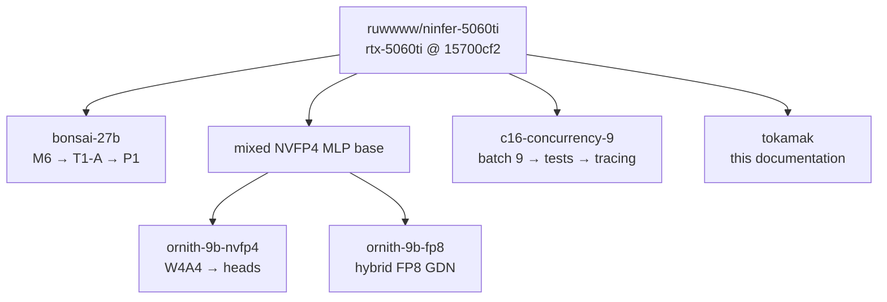

# Branch guide

Two branch kinds, different purposes. Both are pushed as-is — no squashes, no rebases,
so commit dates show the real day-by-day work (13 Sep → 6 Oct 2026).

## Showcase branches (read these)

Curated, English-only, logical commits on top of upstream `rtx-5060ti`. Each one was
built and tested commit-by-commit in an isolated container before pushing.

| Branch | New commits (+1 upstream base) | Content |
|---|---|---|
| `bonsai-27b` | 3 | M6 ternary core + Prism contracts → T1-A decode → P1 prefill (gated) |
| `ornith-9b-nvfp4` | 3 | Mixed MLP base → dynamic W4A4 → native output head |
| `ornith-9b-fp8` | 2 | Mixed MLP base → hybrid FP8 GDN |
| `c16-concurrency-9` | 3 | Batch 8→9 → 9-wide tests → C9TRACE diagnostics |
| `tokamak` (this branch) | docs | This README and `docs/tokamak/` — no code changes |

## Experiment branches (archaeology)

Full uncut history. `exp/qwen38-ternary` (39 commits) is the Bonsai integration line;
`exp/m7-prefill-p1` / `exp/m7-decode-d2` are its prefill/decode siblings (decode frozen,
not promoted). Ornith lines: `feature/ornith-nvfp4-heads` (canonical, 16),
`pr/ornith-nvfp4-heads` (review slice, 7), `experiment/ornith-dynamic-w4a4` (12),
`feature/ornith-fp8-gdn` (7), `perf/ornith-nvfp4-large-t` (8),
`feature/ornith-nvfp4-mlp` (3, shared root). `experiment/c16-5060ti` holds the raw
un-curated c16 snapshot; the `orphan/fp8-gdn-kitchen-*` tag (a tag, not a branch)
marks a superseded FP8 attempt (canonical: `feature/ornith-fp8-gdn`).

## Tags

`ornith-*-working / graduated / qualified` mark qualification milestones from the
original work sessions. `v0.1-p1` (pending) will mark the first Tokamak release.
